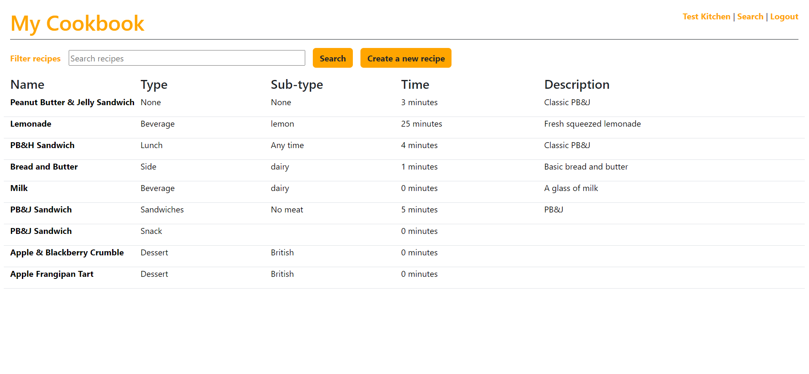
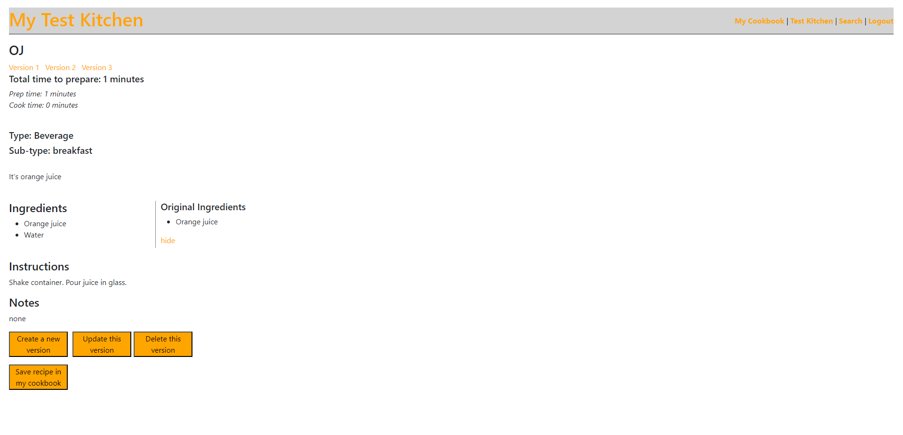

Welcome to Project Cookbook, a Python/Flask app designed to help you build your own cookbook with your own personal recipes.  You can begin by creating your own recipes and adding them to the cookbook or by searching the integrated API to find some ideas. If you find a recipe you like in the API, you can save it to your own cookbook.

Once you have found the recipe you want, you can save it to your own cookbook. Once it's saved, you have the option of sending it to your test kitchen to experiment on at will.

Within your test kitchen, you have the option of creating new versions of this recipe. Creating a new version will make a copy of the recipe (opening into an edit page) and display the original recipe data alongside the new version. You can then make any necessary adjustments or notes. Once you have this version the way you want it, you simply save it and then jump into the kitchen to see how it turns out.

The app also associates all of the versions with their original by storing the original recipe's id on any new versions. This gives you access to all versions of this recipe, listed at the top of the recipe page.

Once you have the recipe the way you want it, you can click "Save recipe in my cookbook" and it will change the recipe you're currently working on in two ways: It will set the "Test" property to false (making it an active recipe in your cookbook) and it will set its own id as the original.

The app does not automatically delete any recipes, as it is often helpful to be able to look back at previous notes. These notes are available for as long as the original recipe is marked as a "Test" recipe. If you move that recipe out of test and want access to the notes on other versions, you simply have to move that original back to the test kitchen with the click of a button and all of your versions will once again be visible to you.

To run project:
1. Install dependencies - 
pipenv install

2. Open environment-
pipenv shell

3. Run server
python server.py